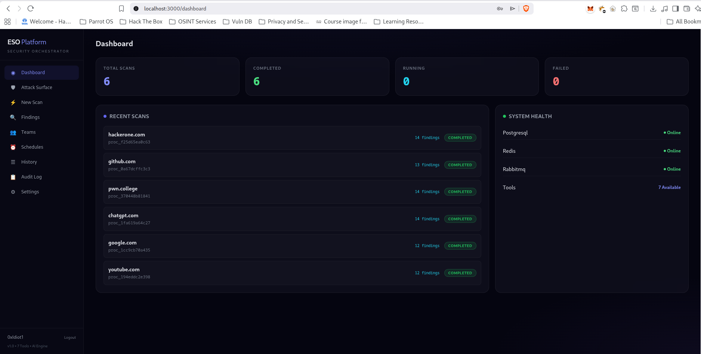
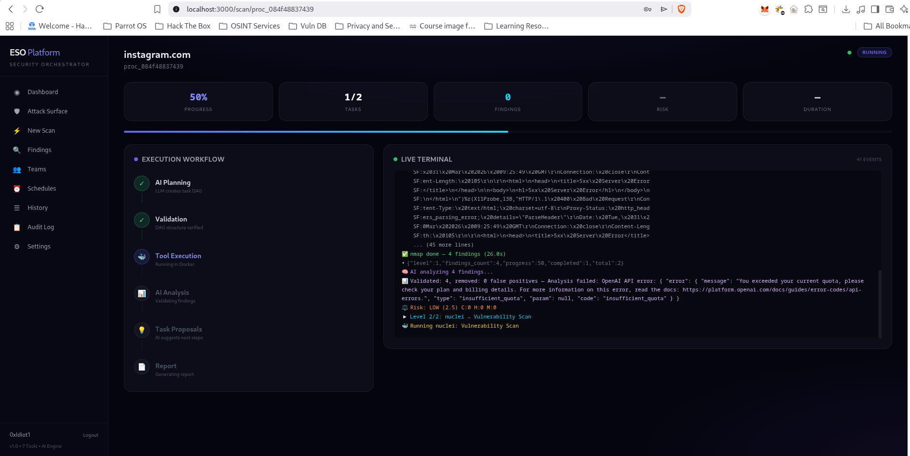
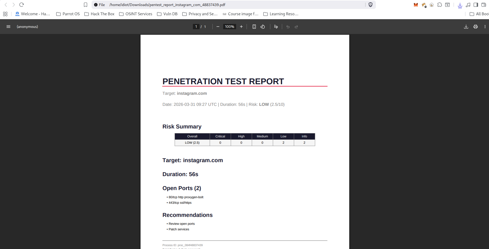
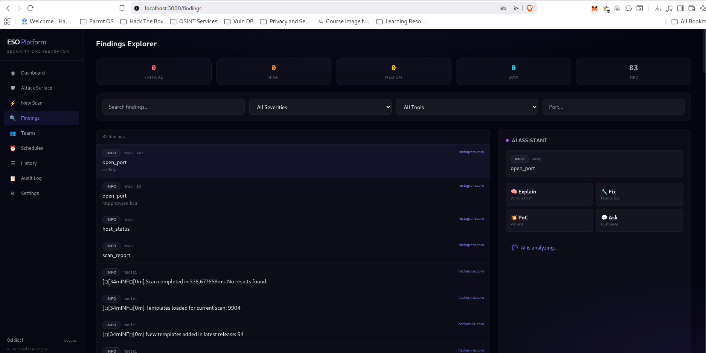
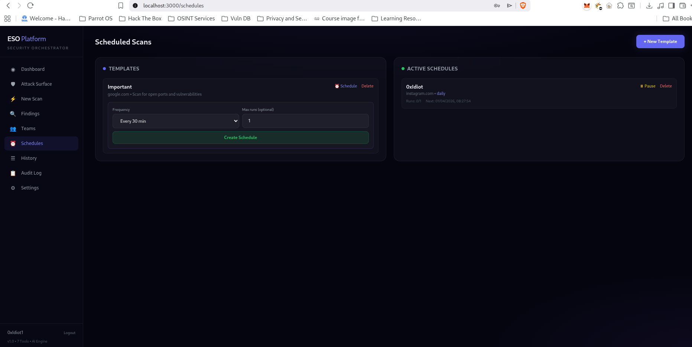
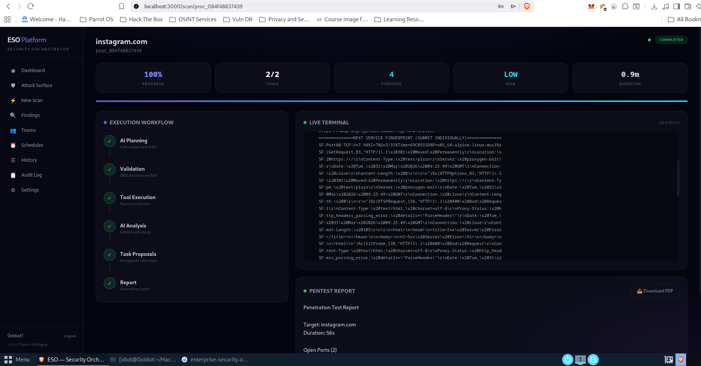

# 🛡️ Enterprise Security Orchestrator (ESO)

**AI-powered penetration testing platform** — describe what you want to scan, and the AI plans it, executes it, analyzes results, and generates a professional report.

[](LICENSE)
[](https://python.org)
[](https://nextjs.org)

---

## Demo

<!-- Add your screenshots/videos here -->
<!-- Recommended: Record a short demo with OBS or use screenshots -->

| Dashboard | Live Scan | Report |
|-----------|-----------|--------|
|  |  |  |

| Findings Explorer | Scheduled Scans | Workflow |
|-------------------|-----------------|----------|
|  |  |  |

> **📹 Video Demo:** [Watch the full walkthrough](docs/demo.mp4) *(add your recording here)*

---

## How It Works

```
"Scan example.com for vulnerabilities"
        ↓
   🧠 AI Planner (GPT-4 / Ollama)
        ↓
   ✅ Plan Validation
        ↓
   🐳 Docker Tool Execution (nmap → nuclei → ...)
        ↓
   📊 AI Analysis (validate findings, remove false positives)
        ↓
   ⚖️ CVSS Risk Scoring
        ↓
   💡 AI Task Proposals → ⏸️ Your Approval
        ↓
   📄 AI Report Generation → 📥 PDF Export
```

---

## Features

### Core
- **AI-Powered Planning** — GPT-4 or Ollama breaks your goal into executable tasks
- **7 Security Tools** — nmap, nuclei, gobuster, sqlmap, nikto, ffuf, whatweb
- **Docker Isolation** — each tool runs in its own container
- **Human-in-the-Loop** — AI proposes follow-up tasks, you approve before execution
- **CVSS Risk Scoring** — automated severity assessment with stop conditions

### Real-Time
- **WebSocket Streaming** — watch tool output appear line-by-line as it happens
- **Execution Workflow** — visual 6-step pipeline (plan → validate → execute → analyze → propose → report)
- **Live Terminal** — colored event stream with tool output, analysis results, risk updates

### Data & Reports
- **PDF Reports** — professional downloadable pentest reports
- **Findings Database** — all findings stored in PostgreSQL, searchable across scans
- **Scan History** — full history with risk trends, duration, tool usage

### Enterprise
- **Auth System** — JWT + API keys, user registration
- **Target Allowlist/Denylist** — prevent unauthorized scanning (legal compliance)
- **Audit Log** — every action persisted to PostgreSQL, queryable
- **Scheduled Scans** — cron-like recurring scans with templates
- **Scan Templates** — save and reuse scan configurations
- **LLM Provider Switch** — toggle OpenAI ↔ Ollama at runtime (no restart)
- **Webhook Notifications** — Slack, Discord, HTTP (built, ready to wire)

### Frontend
- **Next.js 14 Dashboard** — glassmorphism design, responsive
- **7 Pages** — Dashboard, New Scan, Findings, Schedules, History, Audit, Settings
- **Mobile-Friendly** — responsive sidebar with hamburger menu

---

## Quick Start

### Prerequisites
- Docker & Docker Compose
- Python 3.11+
- Node.js 18+ (for frontend)
- Ollama (free, local LLM) OR OpenAI API key

### 1. Clone & Configure
```bash
git clone https://github.com/yourusername/enterprise-security-orchestrator.git
cd enterprise-security-orchestrator
cp .env.example .env
# Edit .env — set LLM_PROVIDER=local for free Ollama, or add OPENAI_API_KEY
```

### 2. Start Infrastructure
```bash
docker compose up -d
```

### 3. Build Tool Images
```bash
bash build_workers.sh
```

### 4. Install & Run Backend
```bash
python -m venv venv
source venv/bin/activate
pip install -r requirements.txt
uvicorn src.api.app:app --host 0.0.0.0 --port 8000 --reload
```

### 5. Install & Run Frontend
```bash
cd eso-frontend
npm install
npm run dev
# Opens at http://localhost:3000
```

### 6. Run Your First Scan
Open `http://localhost:3000`, register an account, and launch a scan!

Or via API:
```bash
curl -X POST http://localhost:8000/api/v1/hybrid/execute \
  -H "Content-Type: application/json" \
  -d '{"goal": "Scan scanme.nmap.org for open ports and vulnerabilities", "target": "scanme.nmap.org"}'
```

---

## LLM Providers

### Ollama (Free, Local)
```bash
# Install
curl -fsSL https://ollama.ai/install.sh | sh

# Pull a model
ollama pull qwen2.5:7b

# Set in .env
LLM_PROVIDER=local
LOCAL_LLM_URL=http://localhost:11434
LOCAL_LLM_MODEL=qwen2.5:7b
```

### OpenAI
```bash
LLM_PROVIDER=openai
OPENAI_API_KEY=sk-your-key-here
OPENAI_MODEL=gpt-4
```

Switch at runtime from the Settings page — no restart needed.

---

## API Reference

### Authentication
| Method | Endpoint | Description |
|--------|----------|-------------|
| POST | `/api/v1/auth/register` | Create account |
| POST | `/api/v1/auth/login` | Get JWT tokens |
| GET | `/api/v1/auth/me` | Current user |
| POST | `/api/v1/auth/api-keys` | Create API key |

### Scanning
| Method | Endpoint | Description |
|--------|----------|-------------|
| POST | `/api/v1/hybrid/execute` | Start a scan |
| GET | `/api/v1/hybrid/status/{id}` | Scan status + report |
| GET | `/api/v1/hybrid/proposals/{id}` | Pending AI proposals |
| POST | `/api/v1/hybrid/approve/{id}` | Approve/reject proposals |
| GET | `/api/v1/hybrid/report/{id}/pdf` | Download PDF report |
| WS | `/api/v1/ws/scan/{id}` | WebSocket live events |

### Findings
| Method | Endpoint | Description |
|--------|----------|-------------|
| GET | `/api/v1/auth/findings` | Search findings (filters: severity, source, port, search) |
| GET | `/api/v1/auth/findings/stats` | Aggregated stats |
| GET | `/api/v1/auth/scans/{id}/findings` | Findings for a scan |

### Scheduled Scans
| Method | Endpoint | Description |
|--------|----------|-------------|
| POST | `/api/v1/schedules/templates` | Create scan template |
| GET | `/api/v1/schedules/templates` | List templates |
| POST | `/api/v1/schedules/` | Create scheduled scan |
| GET | `/api/v1/schedules/` | List schedules |
| PUT | `/api/v1/schedules/{id}/toggle` | Pause/resume |

### System
| Method | Endpoint | Description |
|--------|----------|-------------|
| GET | `/api/v1/system/info` | System info + LLM provider |
| POST | `/api/v1/system/llm/switch` | Switch LLM provider |
| GET | `/api/v1/system/audit` | Query audit logs |
| GET/POST | `/api/v1/system/targets` | Manage target allowlist |

---

## Architecture

```
┌─────────────────────────────────────────────────────────┐
│              Next.js Frontend (port 3000)                │
│  Dashboard │ Scan │ Findings │ Schedules │ Settings      │
├─────────────────────────────────────────────────────────┤
│              FastAPI Backend (port 8000)                  │
│  REST API + WebSocket + JWT Auth + Rate Limiting         │
├─────────────────────────────────────────────────────────┤
│                 Execution Engine                          │
│  Planner → Validator → Controller → Parser → Analyzer   │
│  Risk Engine → Task Proposer → Report Generator          │
├─────────────────────────────────────────────────────────┤
│           Docker Workers (7 security tools)               │
│  nmap │ nuclei │ gobuster │ nikto │ ffuf │ whatweb │ sql │
├─────────────────────────────────────────────────────────┤
│  PostgreSQL │ Redis │ RabbitMQ │ Ollama/OpenAI           │
└─────────────────────────────────────────────────────────┘
```

---

## Adding New Tools

Each tool needs 3 files — great first contribution!

**1. Dockerfile** (`docker/workers/mytool/Dockerfile`)
**2. Config** (`config/tools/mytool.yaml`)
**3. Parser** (add method to `src/engine/result_parser.py`)

See [CONTRIBUTING.md](CONTRIBUTING.md) for the full guide.

**Tools we'd love to see added:** amass, subfinder, httpx, wpscan, testssl.sh, feroxbuster, dnsrecon

---

## Adding Demo Screenshots

To add screenshots for the README:

```bash
mkdir -p docs/screenshots

# Take screenshots of each page and save:
# docs/screenshots/dashboard.png
# docs/screenshots/live-scan.png
# docs/screenshots/report.png
# docs/screenshots/findings.png
# docs/screenshots/schedules.png
# docs/screenshots/workflow.png

# For video demo, record with OBS Studio and save:
# docs/demo.mp4
```

Or use a tool like [Flameshot](https://flameshot.org/) for annotated screenshots.

---

## Contributing

We welcome contributions! See [CONTRIBUTING.md](CONTRIBUTING.md) for guidelines.

**Good First Issues:**
- Add a new security tool
- Improve result parsers
- Write tests
- Add output formats (SARIF, CSV)

---

## License

MIT License — see [LICENSE](LICENSE) for details.

## Disclaimer

This tool is for **authorized security testing only**. Always obtain proper authorization before scanning any target. The authors are not responsible for misuse.
