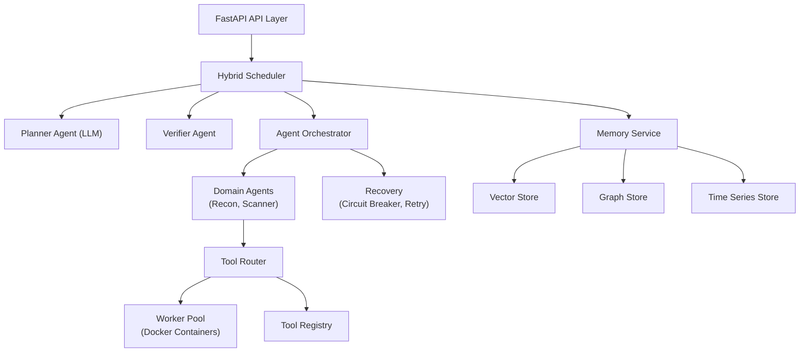

# Enterprise Security Orchestrator — Codebase Analysis

## Overview

A **multi-phase enterprise security orchestration platform** built with FastAPI (Python). It automates security assessments by decomposing high-level goals (e.g., *"Scan example.com for open ports"*) into DAG-based task plans, then executes them via Docker-isolated worker containers running real security tools (nmap, nuclei, gobuster, sqlmap).

---

## Architecture



---

## Project Stats

| Metric | Value |
|---|---|
| Python source files | **66** (excluding [__init__.py](file:///home/idiot/enterprise-security-orchestrator/src/__init__.py)) |
| Packages | **13** (`agents`, `api`, [core](file:///home/idiot/enterprise-security-orchestrator/src/orchestrator/agent_orchestrator.py#137-163), [memory](file:///home/idiot/enterprise-security-orchestrator/src/api/app.py#343-350), `models`, [orchestrator](file:///home/idiot/enterprise-security-orchestrator/src/scheduler/hybrid_scheduler.py#80-84), `recovery`, [scheduler](file:///home/idiot/enterprise-security-orchestrator/src/api/routes/v1/hybrid.py#21-31), `services`, [tools](file:///home/idiot/enterprise-security-orchestrator/src/tools/tool_registry.py#116-119), `utils`, `workers`) |
| API routes | **8** modules (`hybrid`, [health](file:///home/idiot/enterprise-security-orchestrator/src/workers/worker_pool.py#267-304), [memory](file:///home/idiot/enterprise-security-orchestrator/src/api/app.py#343-350), `debug`, `workers`, `agents`, `stream`, [ui](file:///home/idiot/enterprise-security-orchestrator/src/recovery/circuit_breaker.py#94-109)) |
| Lines of code (est.) | **~8,000+** |
| Dependencies | **22** (FastAPI, Docker SDK, OpenTelemetry, LLM clients, etc.) |
| Infrastructure | PostgreSQL, Redis, RabbitMQ (via Docker Compose) |

---

## Module Breakdown

### 1. API Layer (`src/api/`)
- **FastAPI app** with lifespan-based startup/shutdown
- **Middleware stack**: Correlation ID → CORS → GZip → Auth → Rate Limit → Audit
- **Exception handlers**: Custom `EnterpriseBaseException` hierarchy (Auth, Budget, Quota, DAG, Tool, Agent, Worker errors)
- **Routes**: Hybrid execution (POST/GET/cancel), health, agents, workers, debug, streaming, UI

### 2. Scheduler (`src/scheduler/`)
- [hybrid_scheduler.py](file:///home/idiot/enterprise-security-orchestrator/src/scheduler/hybrid_scheduler.py) — Core execution engine
  - Full lifecycle: `PENDING → PLANNING → VALIDATING → QUEUED → RUNNING → COMPLETED/FAILED`
  - DAG-based parallel execution with topological ordering
  - Budget tracking, quota management, pause/resume/cancel ops
  - Global singleton pattern for scheduler access

### 3. Agents (`src/agents/`)
- **Planner Agent** — LLM-powered goal decomposition into DAGs (OpenAI/Anthropic/Local Ollama)
- **Verifier Agent** — DAG validation (cycle detection, resource checks)
- **Domain Agents** — `ReconAgent`, `ScannerAgent` with pluggable intelligence backends:
  - `HardcodedBackend` — Rule-based tool selection
  - `LLMBackend` — LLM-driven analysis
  - `APIBackend` — External API integration
- **Agent Discovery** — Dynamic agent class discovery
- **Memory Bus** — Inter-agent collaboration via pub/sub

### 4. Tools (`src/tools/`)
- **Tool Registry** — Capability-indexed tool catalog with versioning
- **Tool Discovery** — Dynamic discovery from Docker labels + YAML configs
- **Tool Router** — Capability-based selection, load balancing (round-robin, least-loaded, random), fallback chains
- **Rate Limiter** + **Cost Tracker** — Per-user/tenant enforcement

### 5. Workers (`src/workers/`)
- [worker_pool.py](file:///home/idiot/enterprise-security-orchestrator/src/workers/worker_pool.py) — Docker container pool per tool
- Auto-scaling with configurable thresholds
- Health checking loop (60s interval)
- Network isolation per worker
- Container lifecycle management

### 6. Memory (`src/memory/`)
- **Vector Store** — Semantic search for similar tasks/plans (currently in-memory)
- **Graph Store** — Relationship storage (plan→task, task→dependency)
- **Time Series Store** — Execution metrics
- All three are **in-memory implementations** for development

### 7. Recovery (`src/recovery/`)
- **Circuit Breaker** — CLOSED/OPEN/HALF_OPEN state machine
- **Retry Manager** — Configurable retry logic
- **Fallback Manager** — Fallback strategy chains
- **Escalation Manager** — Escalation policies

### 8. Models (`src/models/`)
- [dag.py](file:///home/idiot/enterprise-security-orchestrator/src/models/dag.py) — `DAG`, `TaskNode`, `TaskContext` (Pydantic models)
- [execution.py](file:///home/idiot/enterprise-security-orchestrator/src/models/execution.py) — `Execution`, `TaskExecution` models

### 9. Core (`src/core/`)
- [config.py](file:///home/idiot/enterprise-security-orchestrator/src/core/config.py) — Pydantic Settings with 40+ config options (env-driven)
- [exceptions.py](file:///home/idiot/enterprise-security-orchestrator/src/core/exceptions.py) — 10 custom exception types
- Database, security utilities

---

## Issues & Observations Found

### 🐛 Bugs

| # | File | Issue |
|---|---|---|
| 1 | [app.py:147](file:///home/idiot/enterprise-security-orchestrator/src/api/app.py#L147) | **Typo**: `ackend_type=backend_type` — missing `b` prefix. The parameter passed in `instantiate_agents()` has a typo which likely means the backend type isn't being applied correctly |
| 2 | [base_domain_agent.py:725-766](file:///home/idiot/enterprise-security-orchestrator/src/agents/domain/base_domain_agent.py#L725-L766) | **Duplicate method definitions**: `_analyze_task` and `_create_tool_plan` are defined twice — once at lines 155-205 and again at lines 725-766+. The second definition overrides the first, which changes the behavior |
| 3 | [base_domain_agent.py:53-54](file:///home/idiot/enterprise-security-orchestrator/src/agents/domain/base_domain_agent.py#L53-L54) | **Redundant logic**: `if backend_type is None: backend_type = backend_type or ...` — the `or` is meaningless when `backend_type` is already confirmed `None` |

### ⚠️ Design Concerns

| # | Area | Concern |
|---|---|---|
| 4 | Memory stores | All three stores (Vector, Graph, Time Series) are **in-memory only**. Data is lost on restart |
| 5 | Vector search | `VectorStore.search()` uses naive string matching (`query.lower() in text.lower()`) instead of actual embeddings |
| 6 | `memory_service.py` | File contains **duplicate class definitions** — `VectorStore`, `GraphStore`, `TimeSeriesStore` are defined both in their own files AND inline in memory_service.py  |
| 7 | Worker Pool | `_health_check_loop` and `_auto_scaler_loop` are created via `asyncio.create_task()` in `__init__` — this can fail if no event loop is running at construction time |
| 8 | Hybrid route | In [hybrid.py:71-92](file:///home/idiot/enterprise-security-orchestrator/src/api/routes/v1/hybrid.py#L71-L92), `asyncio.create_task()` wraps `schedule_execution()` which itself creates another background task — double nesting of fire-and-forget tasks |
| 9 | Security | JWT secret is auto-generated via `secrets.token_urlsafe(32)` on each restart, invalidating all existing tokens |
| 10 | `_prepare_tool_args` | The nmap argument builder has a subtle issue: `-sS`, `-sT`, `-sV` check uses `any(arg in str(args))` which can match substrings |

### 📝 Missing/Incomplete

| # | Area | Detail |
|---|---|---|
| 11 | Database layer | `init_database()` and `close_database()` exist but PostgreSQL/Redis/RabbitMQ connections appear unused at runtime |
| 12 | Pagination | `/hybrid/list` does pagination in Python memory rather than database-level |
| 13 | `estimated_completion` | Always returns `None` — marked `# TODO: Calculate` |
| 14 | `current_task` | Always returns `None` — marked `# TODO: Get from lifecycle` |
| 15 | Exploit agent | Referenced in phase3-check.txt but marked as "future" |

---

## Execution Flow

```
POST /api/v1/hybrid/execute
  └─ HybridScheduler.schedule_execution()
       ├─ QuotaManager.check_quota()
       ├─ LifecycleManager.create_execution()
       └─ _execute_planning_phase() [background]
            ├─ MemoryService.find_similar_tasks()
            ├─ PlannerAgent.create_plan()  [LLM call]
            ├─ VerifierAgent.validate_dag()
            ├─ BudgetTracker.check_budget()
            └─ _execute_execution_phase()
                 └─ For each DAG level (parallel):
                      └─ AgentOrchestrator.route_task_to_agent()
                           ├─ _score_agent_for_task()  [capability matching]
                           └─ DomainAgent.execute()
                                ├─ _analyze_task()
                                ├─ _create_tool_plan()
                                ├─ _execute_tool_plan()
                                │    └─ ToolRouter.route_and_execute()
                                │         └─ WorkerPool.execute()
                                │              └─ Docker container exec
                                ├─ _verify_and_parse_results()
                                └─ _learn_from_execution()
```

---

## Configuration

Key settings from [config.py](file:///home/idiot/enterprise-security-orchestrator/src/core/config.py):

| Setting | Default | Notes |
|---|---|---|
| `LLM_PROVIDER` | `local` (Ollama) | Supports: openai, anthropic, local, azure, vertex |
| `LOCAL_LLM_MODEL` | `qwen2.5:3b` | Model for local LLM |
| `AGENT_BACKEND` | `hardcoded` | Rule-based (no LLM needed for agents) |
| `MIN_WORKERS_PER_TOOL` | `1` | Docker containers |
| `MAX_WORKERS_PER_TOOL` | `5` | Auto-scaling ceiling |
| `RATE_LIMIT_DEFAULT` | `100/minute` | Per-user |

---

## Summary

The codebase is a well-structured, ambitious security orchestration platform split into 3 development phases. The architecture follows enterprise patterns (multi-tenancy, circuit breakers, audit logging, cost tracking). However, it currently runs with **in-memory stores** and has **several bugs** (typo in app.py, duplicate method definitions) that should be addressed. The Docker-based tool execution pipeline is the most production-ready component.
